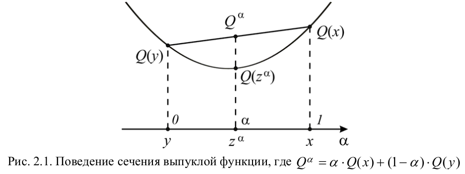

# 4. Выпуклая функция – определение, пояснение с помощью рисунка.

### Определения

-   **Функцию** Q , определенную на выпуклом множестве D , называют **выпуклой** на D , если epiQ (D ) - выпуклое множество.
    -   Пусть на множестве  задана функция Q. Множество  называют ее **надграфиком** (**эпиграфом**), если
        
-   **Функция** Q , определенная на выпуклом множестве , называется **выпуклой** (**выпуклой вниз**) на D , если 
    
-   Если при тех же условиях вместо неравенства вида «≤» выполняется неравенство вида «≥», то **функция** называется **вогнутой (выпуклой вверх)**. Если 
     функция называется **строго выпуклой (строго вогнутой)**.
-   Согласно последних определений **выпуклость функции** Q на D
    **геометрически** означает, что для всякого отрезка [x, y], включенного в D, график этого отрезка () проходит нестрого ниже соответствующей хорды, опирающейся на значения Q (x) и Q (y) (рис. 2.1).

-   Если **функция** Q является **аффинной**, т.е. Q (x) = a ⋅ x + b , то она **одновременно и выпукла и вогнута**.

### Критерий выпуклости дифференцируемой функции Q (x)

На открытом выпуклом множестве D функция Q (x) выпукла тогда и только тогда, когда 

Неравенство означает, что график (поверхность) функции всюду проходит нестрого выше ее линейного приближения (касательной гиперплоскости), построенного по измерениям функции Q и ее градиента ∇Q в произвольной точке y из D.
