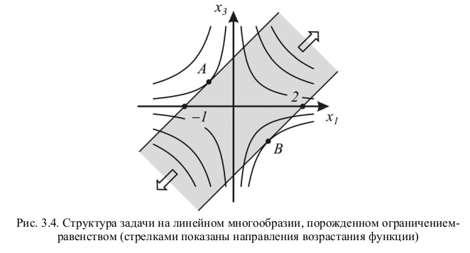

# 17. Условия К.-К.-Т для невыпуклой задачи - разобрать на примере.

## Условия Каруша-Куна-Таккера

Если функции ,g_{2}(x),\dots,g_{N}(x)>) выпуклы (вниз), ограничения – равенства либо отсутствуют, либо аффинны, функция Q(x) выпукла (вниз), то такая **задача**
называется **выпуклой**. В противном случае **задача невыпукла**.

Для задач, **не обладающих выпуклостью**, необходимые условия наличия в  локального минимума дает следующая **теорема Каруша-Куна-Таккера**.

Для того, чтобы точка  была локальным минимумом рассматриваемой задачи, необходимо выполнение группы условий:

-    - допустимость
-   \neq0>) - нетривиальность
-    - неотрицательность
-   =\sum_{i=1}^{N}\lambda_{i}^{*}\bigtriangledown&space;g_{i}(x^{*})+\sum_{j=1}^{M}\mu_{j}^{*}\bigtriangledown&space;h(x^{*})>) - разложимость
-   =0,&space;j\in\left&space;[1,N&space;\right]>) - условие дополняющей нежесткости

## Пример невыпуклой задачи

Пусть **требуется найти глобальный минимум** в задаче:

Допустимая область D задана линейными ограничениями (равенствами и неравенствами) и является выпуклой. Более того, нетрудно подобрать такую допустимую точку, например, , что неравенства выполняются строго, следовательно, для области D выполнено достаточное условие регулярности Слейтера. Поскольку все ограничения в задаче аффинны, можно было для выяснения вопроса о регулярности воспользоваться не самим условием Слейтера, а следствием из него для областей такого вида. Тогда было бы достаточно установить только непустоту множества D . Это значит, что в условиях Каруша-Куна-Таккера всегда можно считать .

**Матрица Гессе** имеет вид:

Поскольку **главные миноры** матрицы вторых производных **обращаются в нули**, то по критерию Сильвестра **нельзя выяснить знакоопределенность матрицы**.

Запишем ее характеристический полином относительно переменной p : . Подсчитав собственные числа, видим, что . Следовательно, **матрица Гессе является знаконеопределенной**, а минимизируемая **функция не является выпуклой**.

Поскольку задача не является выпуклой, условия Каруша-Куна-Таккера не будут являться достаточными, а будут лишь необходимыми условиями локального минимума. Поскольку условия оптимальности в этой задаче лишь только необходимы, то сначала следует доказать существование минимума в этой задаче. Если решение существует, то далее придется отыскивать все точки, где эти условия выполняются, и затем, сравнивая значение функции в этих точках, определять глобальный минимум.

В рассматриваемой задаче для упрощения решения можно, используя связь , исключить  из ограничений.
Тогда задача примет вид:
\in&space;R^{2}:x_{3}-x_{1}\geqslant&space;1,x_{1}-x_{3}\leqslant&space;2}>)

Поскольку в пространстве переменных  матрица вторых производных минимизируемой функции новой задачи

имеет собственные числа ,то поверхность  является седловой (что, впрочем, непосредственно видно из ее формулы) и функция не имеет конечных безусловных минимумов. При этом либо минимума вообще нет, либо он достигается на границах области. Проанализируем вопрос о существовании минимума.

**Проведем исследование**. Область  неограниченна. Изучим поведение функции вдоль прямых >), параллельных границам области. Введем вектор >), направленный вдоль этих прямых. Функция Q (x) имеет по направлению ν положительную вторую производную, поскольку

Отсюда и из квадратичного вида функции Q (x ) следует **существование конечного минимума в задаче**, поскольку **на бесконечности функция будет возрастать равномерно по параметру c**.

Исследуем границу .Система условий Куна-Таккера примет вид:

Они выполняются при  (точка B на рис. 3.4). Значение функции равно − 1 , т.е. меньше, чем в первой найденной точке. Следовательно, **глобальный минимум** вспомогательной задачи **достигается в точке** , а для исходной задачи — **в точке** 

